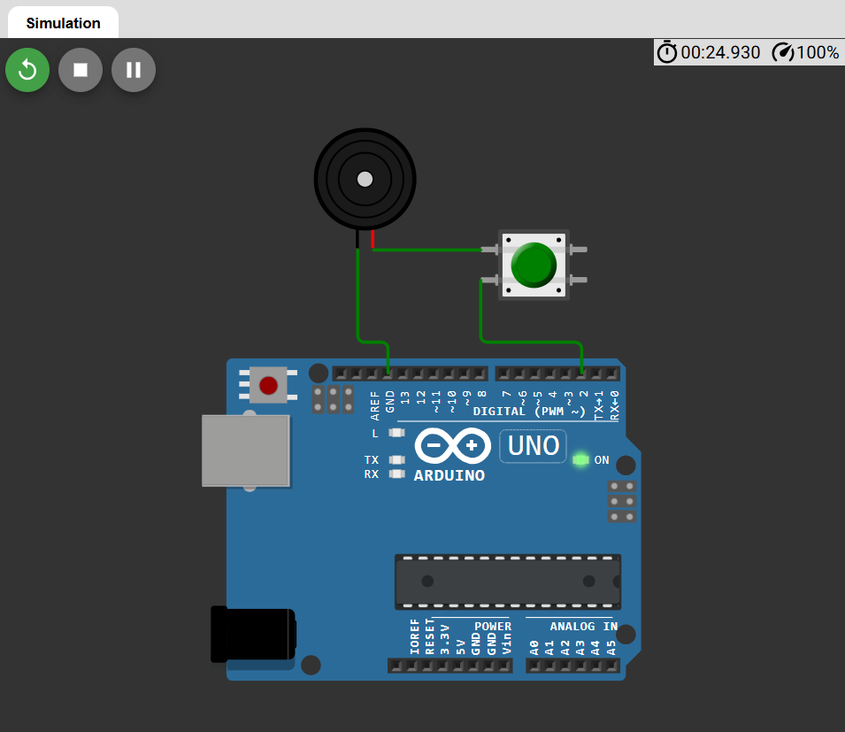

# 🔔 Arduino Buzzer Control Using Button (Series Connection)

This is a **basic Arduino beginner project** where a **buzzer sounds only when the button is pressed**.  
No button logic is written in the code — the **button is connected in series with the buzzer**, so control is handled by hardware.

---

## 🧩 Project Overview

- 🧠 Concept: **Hardware-based control (Series connection)**
- 🔊 Output Device: Buzzer
- 🔘 Input Device: Push Button
- 💻 Platform: Arduino (Uno / Nano / Mega)

---

## 🔌 Components Required

| Component | Quantity |
|----------|----------|
| Arduino Board | 1 |
| Buzzer | 1 |
| Push Button | 1 |
| Jumper Wires | As required |

---


## 🔗 Simulation Link

👉 [Open Simulation](https://wokwi.com/projects/454507915225142273)
## 🔌 Circuit Diagram

👉 
## 🔌 Circuit Connection

### 🔁 Connection Sequence

GND → Buzzer (-) → Buzzer (+) → Button → Arduino Pin 2


### 📌 Details
- Buzzer negative terminal → **GND**
- Buzzer positive terminal → **Button**
- Button other terminal → **Arduino Digital Pin 2**

⚠️ The buzzer turns ON only when the button is pressed, completing the circuit.

---

## 🧾 Arduino Code

```cpp
#define buzzer 2  

void setup() {
  pinMode(buzzer, OUTPUT);
}

void loop() {
  digitalWrite(buzzer, HIGH);
}
```
---
## ⚙️ Working Principle
- Arduino pin D2 is always set to HIGH

- Button is connected in series with the buzzer

- 🔘 Button pressed → circuit completes → 🔊 buzzer ON

- 🔘 Button released → circuit breaks → 🔇 buzzer OFF

- ❌ No digitalRead() or software button logic used

## 📸 Output Behavior
| Button State | Buzzer Status |
| ------------ | ------------- |
| Pressed      | 🔊 ON         |
| Released     | 🔇 OFF        |

--- 
## 🎯 Learning Outcomes

- Understanding series circuit connection

- Difference between hardware control vs software control

- Basic use of Arduino digital OUTPUT

- Real-world switch operation
## 👨‍💻 Author


**Bishnupriya**