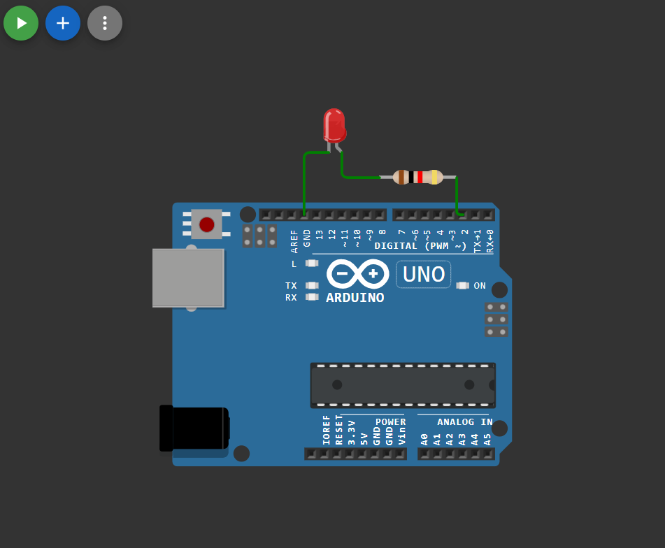

# 💡 Arduino LED Blink (Digital Output Example)

A simple beginner-friendly Arduino project to blink an LED using digital output. This project demonstrates how to configure a GPIO pin as OUTPUT and toggle it using `digitalWrite()` with delays.

---

## 🚀 Project Overview

This project blinks an LED connected to an Arduino board at a fixed interval (600 ms ON / 600 ms OFF). It is one of the most basic and important starter projects for learning embedded systems and microcontroller GPIO control.

---

## 🧰 Components Required

- Arduino Board (Uno / Nano / Mega / etc.)
- LED (if not using onboard LED)
- 220Ω Resistor (for external LED)
- Jumper Wires
- Breadboard (optional)

---
## 🔗 Simulation Link

👉 [Open Simulation](https://wokwi.com/projects/454503985842308097)
## 🔌 Circuit Diagram

👉 
## 🔌 Circuit Connection

### ✅ Using Onboard LED
If your board supports onboard LED on the selected pin, no external wiring is required.

### ✅ Using External LED

| Arduino Pin | Component |
|--------------|------------|
| Pin 2        | LED Anode (+) |
| GND          | LED Cathode (–) via 220Ω resistor |

---

## 📜 Arduino Code

```cpp
#define LED 2

void setup() {
  pinMode(LED, OUTPUT);
}

void loop() {
  digitalWrite(LED, HIGH);
  delay(600);

  digitalWrite(LED, LOW);
  delay(600);
}
```

---

## ⚙️ How It Works

- `#define LED 2` → assigns GPIO pin 2 as LED pin
- `pinMode(LED, OUTPUT)` → sets the pin as output
- `digitalWrite(HIGH)` → turns LED ON
- `digitalWrite(LOW)` → turns LED OFF
- `delay(600)` → waits 600 milliseconds between states

**Blink Timing:**

- ON Time = 600 ms  
- OFF Time = 600 ms  
- Total Cycle = 1.2 seconds

---

## ▶️ How to Run

1. Open Arduino IDE
2. Select your board and COM port
3. Paste the code
4. Click **Upload**
5. Observe LED blinking

---

## 🎯 Learning Outcomes

- GPIO Output control
- Using `pinMode()` and `digitalWrite()`
- Understanding delays and timing
- Basic embedded programming concept

---


## 👨‍💻 Author


**Bishnupriya**
