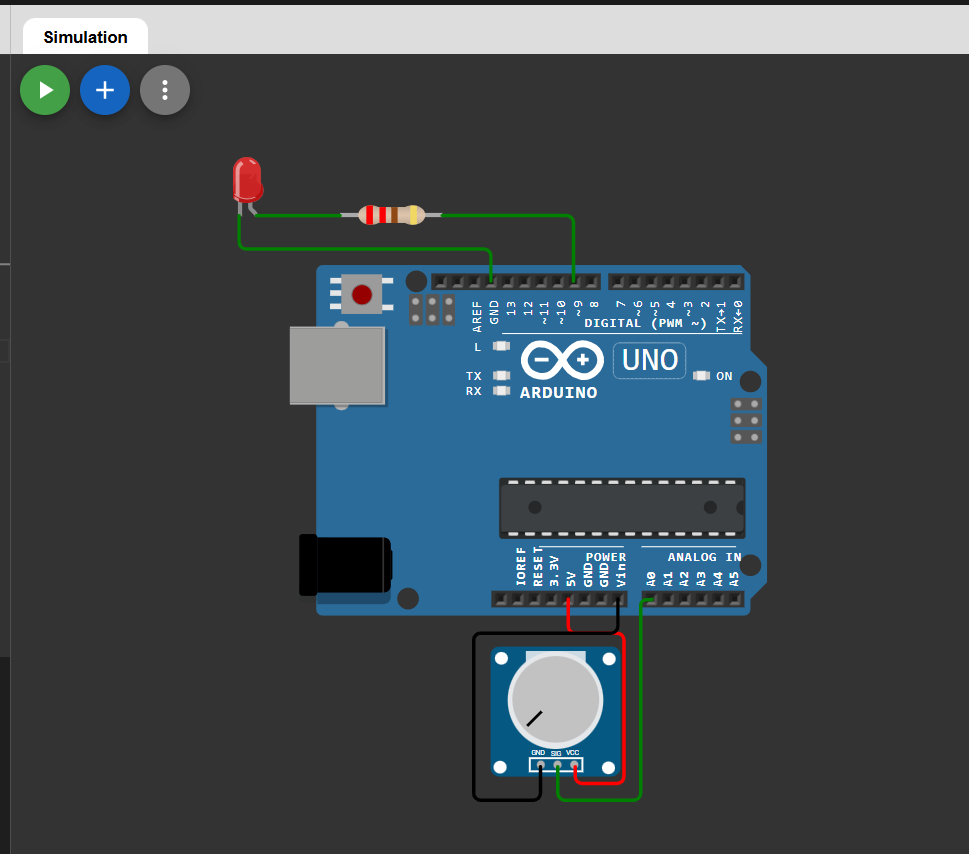

# Arduino LED Brightness Control using Potentiometer

A beginner-friendly Arduino project where the brightness of an LED is controlled using a potentiometer.  
This project demonstrates **analog input**, **PWM output**, and basic Arduino interfacing.

---


## 🔧 Components Required
- Arduino Uno  
- Potentiometer (10kΩ)  
- LED  
- 220Ω Resistor  
- Jumper Wires  

---

## 🔗 Simulation Link

👉 [Open Simulation](https://wokwi.com/projects/454850976316928001)
## 🔌 Circuit Diagram

👉 


## 🔌 Circuit Connections

### Potentiometer
| Pot Pin | Arduino Pin |
|-------|-------------|
| Left  | 5V          |
| Middle| A0          |
| Right | GND         |

### LED
| LED Pin | Arduino Pin |
|--------|-------------|
| Anode (+) | PWM Pin 9 (via 220Ω resistor) |
| Cathode (–) | GND |

---

## 💻 Arduino Code

```cpp
int potPin = A0;   // Potentiometer connected to A0
int ledPin = 9;    // LED connected to PWM pin

void setup() {
  pinMode(ledPin, OUTPUT);
}

void loop() {
  int potValue = analogRead(potPin);      // Read potentiometer value (0–1023)
  int brightness = map(potValue, 0, 1023, 0, 255);
  analogWrite(ledPin, brightness);        // Control LED brightness
}
```
## ⚙️ How It Works

- The potentiometer provides an **analog input (0–1023)**.
- Arduino maps this value to the **PWM range (0–255)**.
- LED brightness changes smoothly as the potentiometer is rotated.

---

## 🚀 Applications

- Light dimmer circuits  
- User input control systems  
- Understanding analog sensors  
- PWM-based control projects  


## 👨‍💻 Author


**Bishnupriya**