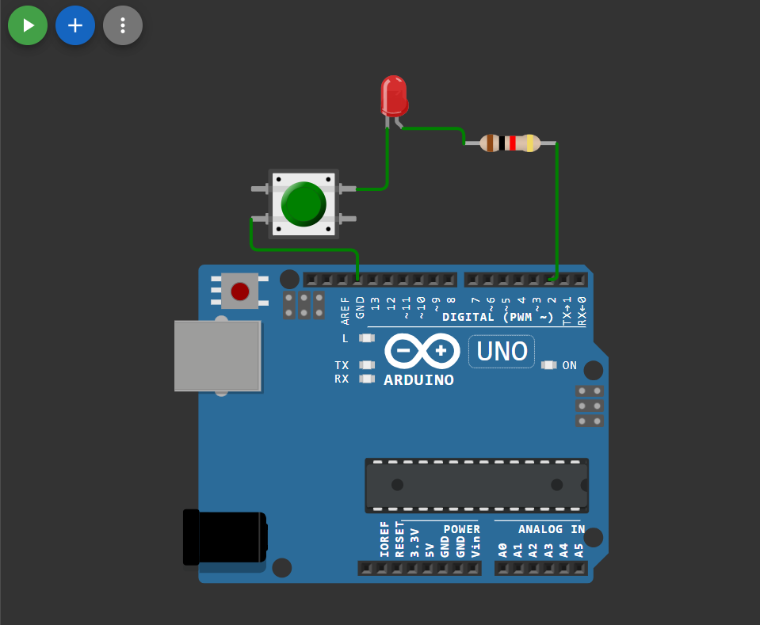

# 🔘💡 Arduino LED with Series Button Control

This Arduino project shows how to control an LED using a push button connected in **series** with the LED and resistor.

The LED turns ON only when the button is pressed because the circuit path is completed.

---
## 🔗 Simulation Link

👉 [Open Simulation](https://wokwi.com/projects/454508283350862849)
## 🔌 Circuit Diagram

👉 
## 📌 Arduino Code

```cpp
#define LED 2

void setup() {
  pinMode(LED, OUTPUT);
}

void loop() {
  digitalWrite(LED, HIGH);
}
```

---

## ⚙️ How It Works

- Pin 2 is set as OUTPUT
- Pin is driven HIGH continuously
- LED and button are connected in series to GND
- When button is pressed → circuit completes → LED glows
- When button is released → circuit breaks → LED OFF

No input reading is required because the button is used as a hardware switch.

---

## 🧰 Components Required

- Arduino board
- LED
- Push button
- 220Ω resistor
- Jumper wires
- Breadboard

---

## 🔌 Circuit Connection

Pin 2 → Resistor → LED → Button → GND

Button acts as a series switch.

---

## ▶️ Upload Steps

1. Open Arduino IDE
2. Select board & port
3. Paste code
4. Upload
5. Press button → LED ON

---

## 🎯 Learning Outcome

- Series circuit control
- Using button as hardware switch
- Basic Arduino digital output

---

✅ Simple hardware-controlled LED project.

## 👨‍💻 Author


**Bishnupriya**