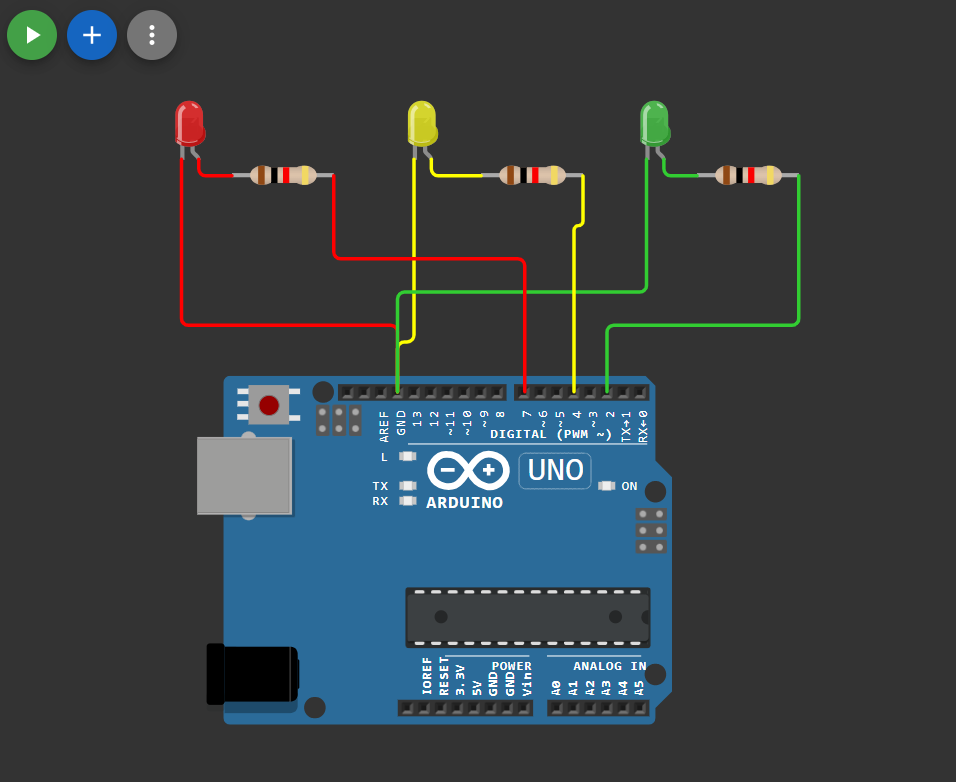

# 🚦 Traffic Light System using Arduino

This project demonstrates a **basic traffic light control system** using an Arduino board and three LEDs (Red, Yellow, Green).  
Each LED turns ON and OFF sequentially with a fixed delay, simulating real-world traffic signals.

---

## 🔗 Simulation Link

👉 [Open Simulation](https://wokwi.com/projects/454506510576700417)
## 🔌 Circuit Diagram

👉 
## 🔌 Circuit Connection


## 🔧 Components Required

- Arduino Uno / Nano / Mega  
- 3 × LEDs (Red, Yellow, Green)  
- 3 × 220Ω Resistors  
- Breadboard  
- Jumper Wires  

---

## 🔌 Pin Connections

| LED Color | Arduino Pin |
|----------|-------------|
| Red      | D7          |
| Yellow   | D4          |
| Green    | D2          |

---

## 🧠 Working Principle

- The **Red LED** turns ON for 600 ms, then turns OFF  
- The **Yellow LED** turns ON for 600 ms, then turns OFF  
- The **Green LED** turns ON for 600 ms, then turns OFF  
- This cycle repeats continuously, simulating a traffic signal sequence

---

## 💻 Arduino Code

```cpp
#define red 7
#define yellow 4
#define green 2

void setup() {
  pinMode(red, OUTPUT);
  pinMode(yellow, OUTPUT);
  pinMode(green, OUTPUT);
}

void loop() {
  digitalWrite(red, HIGH);
  delay(600);
  digitalWrite(red, LOW);
  delay(600);

  digitalWrite(yellow, HIGH);
  delay(600);
  digitalWrite(yellow, LOW);
  delay(600);

  digitalWrite(green, HIGH);
  delay(600);
  digitalWrite(green, LOW);
  delay(600);
}
```

---
## 📌 Applications

- Beginner Arduino practice
- Understanding digital output control
- Traffic signal simulation
- Embedded systems fundamentals

## 🚀 Future Improvements

- Adjustable timing using potentiometer
- Pedestrian crossing button
- LCD/OLED status display
- Smart traffic system using sensors


## 👨‍💻 Author


**Bishnupriya**